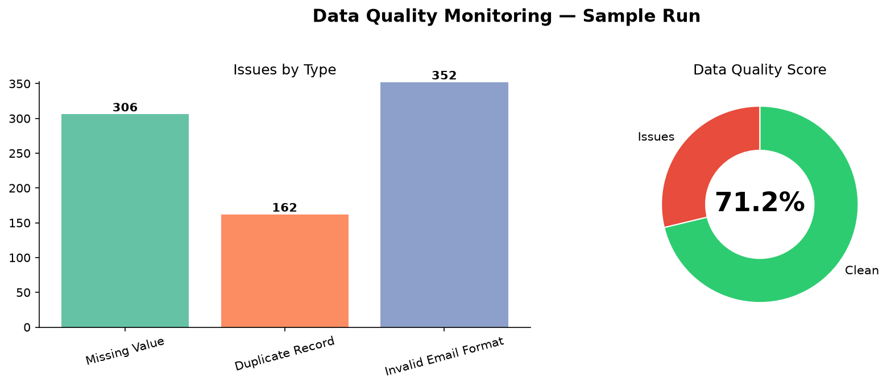
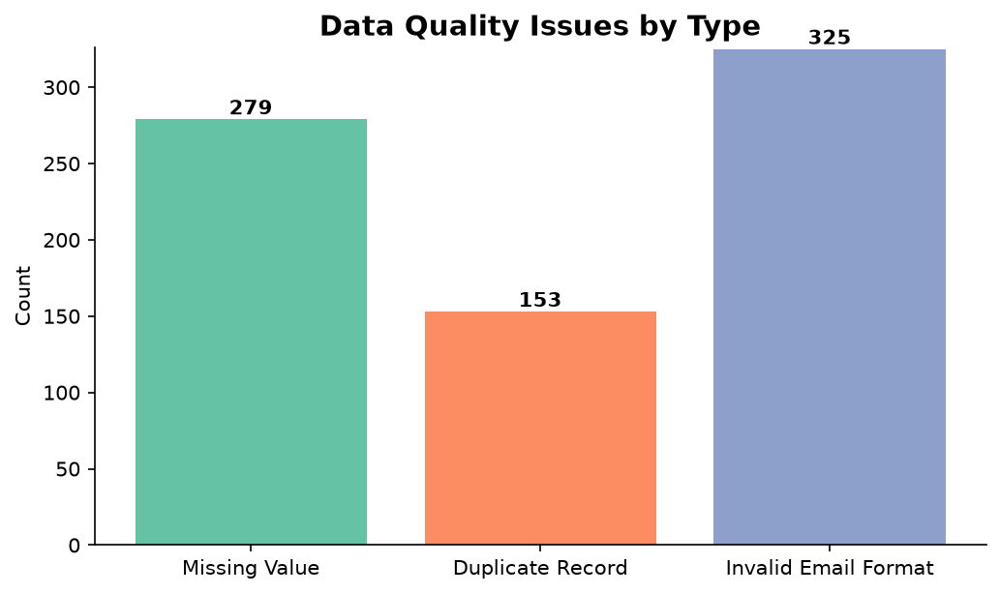
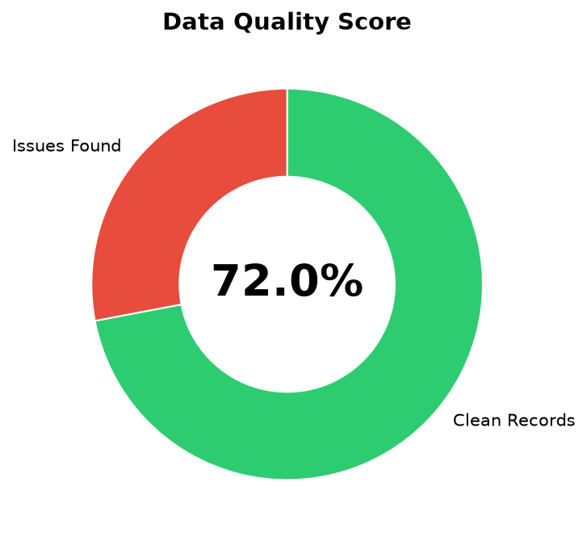

# 📊 Data Quality Monitoring Dashboard

> An end-to-end automated data quality pipeline — built to simulate real-world production workflows in banking, healthcare, and analytics engineering.

---

## 🏢 Business Problem

Every data team faces the same challenge: **bad data flows silently into reporting, causing wrong decisions**.  
This project builds an automated system that catches data quality issues **before** they reach dashboards or business users — the same pattern used at companies like JPMorgan, Optum, and Telstra.

---

## ✅ Features

- **Missing Value Detection** — flags records where critical fields (e.g. email) are blank
- **Duplicate Record Detection** — identifies rows loaded more than once
- **Schema Validation** — catches malformed values (e.g. email without `@`)
- **Delayed Load Alerts** — detects if the daily file wasn't received before the SLA window (10 AM)
- **Automated Issue Logging** — all failures written to a MySQL audit table with timestamps
- **Live Dashboard** — Streamlit dashboard with KPI cards, bar chart, and trend line
- **Email Alerts** — formatted HTML alert email sent automatically when issues are found
- **Scheduled Pipeline** — single-command runner via Windows Task Scheduler or cron

---

## 📸 Dashboard Preview

A sample run of the pipeline against the included dataset (5 records with
intentional issues) — generated by [`scripts/generate_report_charts.py`](scripts/generate_report_charts.py),
which runs the real quality checks and renders the same visuals as the live dashboard:



| Issues by Type | Data Quality Score |
|:---:|:---:|
|  |  |

> Regenerate anytime with `python scripts/generate_report_charts.py` — no MySQL required.
> Live Streamlit / Power BI screenshots can be dropped into `screenshots/` and added here too.

---

## 🛠 Tech Stack

| Layer         | Tool                        |
|---------------|-----------------------------|
| Language      | Python 3.11+                |
| ETL           | Pandas + SQLAlchemy         |
| Database      | MySQL 8                     |
| Dashboard     | Streamlit + Plotly          |
| BI Tool       | Power BI Desktop            |
| Alerts        | Python smtplib (Gmail)      |
| Scheduler     | Windows Task Scheduler      |
| Version Control | GitHub                    |
| Advanced      | Apache Airflow, Great Expectations, Docker |

---

## 📁 Project Structure

```
data-quality-monitoring-dashboard/
│
├── raw_data/
│   └── customer_data.csv          # Sample dataset with intentional issues
│
├── scripts/
│   ├── load_data.py               # Phase 4: ETL — load CSV into MySQL
│   ├── data_quality_checks.py     # Phase 5-6: Run all DQ checks + log issues
│   ├── dashboard_streamlit.py     # Phase 7: Live monitoring dashboard
│   ├── email_alerts.py            # Phase 8: Automated HTML email alerts
│   ├── run_pipeline.bat           # Phase 9: Windows one-click pipeline runner
│   ├── run_pipeline.sh            # Phase 9: Linux/Mac pipeline runner
│   ├── airflow_dag.py             # Phase 11: Apache Airflow DAG
│   └── great_expectations_checks.py  # Phase 11: Advanced validation framework
│
├── sql/
│   └── setup_database.sql         # Phase 3: MySQL schema (2 tables)
│
├── dashboard/
│   └── power_bi_guide.md          # Phase 7: Power BI connection + DAX measures
│
├── advanced/
│   ├── Dockerfile                 # Phase 11: Containerize the pipeline
│   └── docker-compose.yml         # Phase 11: MySQL + pipeline services
│
├── screenshots/                   # Add Power BI / Streamlit screenshots here
├── reports/                       # Future: generated PDF/HTML reports
├── logs/                          # Auto-populated by pipeline runs
│
├── requirements.txt
└── README.md
```

---

## 🚀 Quick Start

### 1. Clone & install
```bash
git clone https://github.com/YOUR_USERNAME/data-quality-monitoring-dashboard.git
cd data-quality-monitoring-dashboard
pip install -r requirements.txt
```

### 2. Set up MySQL
```sql
-- Run in MySQL Workbench or CLI
source sql/setup_database.sql
```

### 3. Configure credentials
Copy the example env file and fill in your real values:
```bash
cp .env.example .env
```
Then edit `.env` with your MySQL password and (optionally) Gmail App Password.
The scripts load these automatically via `python-dotenv`. `.env` is git-ignored,
so your secrets never reach GitHub.

### 4. Run the pipeline
```bash
# Windows
scripts\run_pipeline.bat

# Linux / Mac
bash scripts/run_pipeline.sh
```

### 5. Launch dashboard
```bash
streamlit run scripts/dashboard_streamlit.py
```

---

## 🗄 Database Schema

### `customer_data`
| Column      | Type         |
|-------------|--------------|
| customer_id | INT          |
| name        | VARCHAR(100) |
| email       | VARCHAR(100) |
| age         | INT          |
| load_date   | DATE         |

### `data_quality_issues` *(audit table)*
| Column         | Type         |
|----------------|--------------|
| issue_id       | INT (PK, AI) |
| issue_type     | VARCHAR(100) |
| record_details | TEXT         |
| detected_time  | TIMESTAMP    |

---

## 📊 Dashboard KPIs

| KPI | Description |
|-----|-------------|
| Total Records | Row count in customer_data |
| Missing Values | Records with NULL fields |
| Duplicate Count | Exact-match duplicate rows |
| Schema Errors | Emails missing `@` |
| Daily Load Status | On Time / Delayed vs 10 AM SLA |
| Data Quality Score | `(clean / total) × 100%` |

---

## 🔮 Future Improvements

| Enhancement | Why it matters |
|-------------|----------------|
| **Apache Airflow** | Production-grade scheduling with retry logic and dependency tracking |
| **Great Expectations** | Industry-standard DQ framework with HTML reports |
| **BigQuery** | Cloud-scale warehouse — shows cloud data engineering skills |
| **Slack Alerts** | Real-time team notifications via webhook |
| **Streamlit Cloud** | Deploy dashboard publicly — shareable link for portfolio |
| **Docker** | Reproducible, portable deployment — valued in all data engineering roles |
| **dbt** | SQL-based transformations with lineage — the new industry standard |

---

## 👤 Author

**Darshan**  
Data Engineer | Python • SQL • MySQL • Power BI  
📧 darshandharu0@gmail.com

---

*Built to demonstrate real-world data quality engineering skills for roles in data engineering, analytics engineering, and BI development.*
